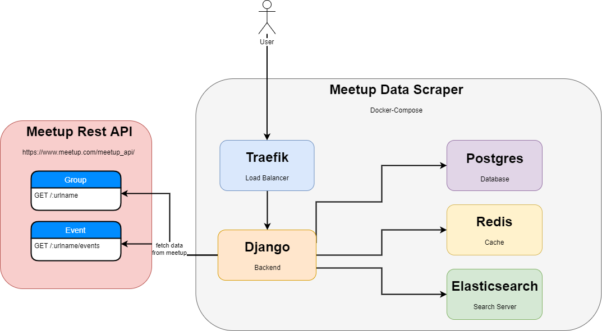

.. Meetup Data Scraper documentation master file, created by
   sphinx-quickstart.
   You can adapt this file completely to your liking, but it should at least
   contain the root `toctree` directive.

Meetup Data Scraper Project Documentation
====================================================================

Table of Contents:

.. toctree::
   :maxdepth: 2

   getting_started
   usage-guide
   advanced_topics
   troubleshooting
   faq

Indices & Tables
================

* :ref:`genindex`
* :ref:`modindex`
* :ref:`search`
